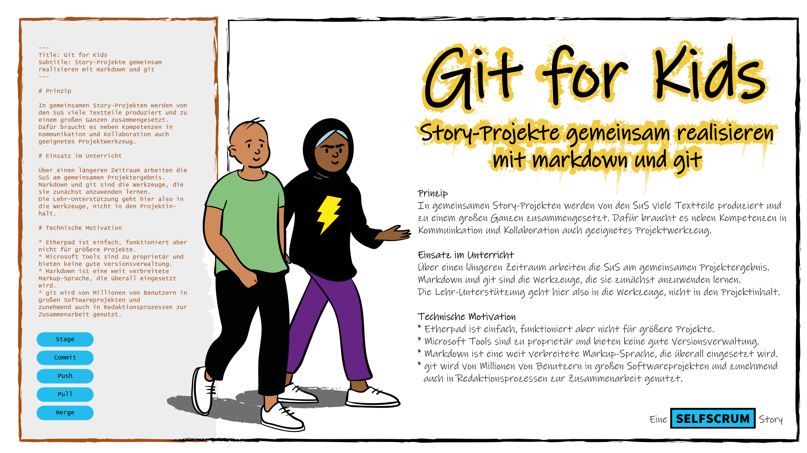

+++
title = "Learn to Learn to Learn Git"
outputs = ["Reveal"] 
weight=10
+++



<h3 style="color: #000;">Learn to Learn to Learn git</h3>

---



## Warum?

* Immer mehr Content in immer kürzerer Zeit
* Verschiedenste Medien
* Grassroot Publishing

---



## Die Lösung?

* Schlankes Editierformat -> **Markdown**
* Co-Authoring und Release Management -> **git**
* Automatisiertes Publishing -> **hugo, github, pandoc**

---



## Vorhaben

<ul>
<li style ="color: #000;"> "Learn enough git to be dangerous" (Michael Hartl)</li>
<li style ="color: #000;"> Sich erarbeiten, wie man git-Konzepte versteht und erklären kann</li>
<li style ="color: #000;"> Einen Guide darüber schreiben</li>
</ul>

